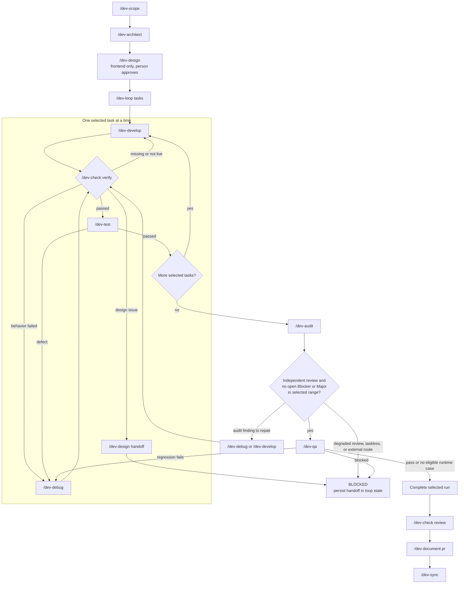

# Kahanas

A document driven engineering workflow, as Agent Skills.

It takes a project from an idea to shipped, verified code, and keeps every decision in version controlled documents rather than in a chat log. A new session reads the documents and knows where things stand, so nothing depends on remembering a conversation that has since been cleared.

Works with any Agent Skills client: Claude Code, Codex, Cursor, and others.

## Install

```bash
# Claude Code (installs into .claude/skills, then restart Claude Code)
npx skills@latest add itumulak/kahanas -a claude-code

# Generic .agents/skills, read by Codex and other agents
npx skills@latest add itumulak/kahanas
```

Commit the installed folder to share the workflow with your team.

Every skill answers to `/dev-scope`, `/dev-architect`, and so on.

**Already on an older version?** Read [UPGRADING.md](UPGRADING.md). The short version: delete and reinstall the skills, and never delete `.konteksto/`, which holds the reasoning the whole workflow exists to keep.

**Why the prefix.** The names these skills want, `scope`, `check`, `test`, are ordinary words. Installed bare, any personal skill of the same name in `~/.claude/skills` shadows them, and the wrong one runs with no error to say which. `dev-scope` collides with nothing.

## The skills

| Skill | What it does |
|---|---|
| `/dev-scope` | Turns an idea into what the product is: pages, flows, and what is deliberately out of scope. Stays tool agnostic. |
| `/dev-context` | Reads the project records in order for a fresh session or handoff, then reports the active task, constraints, and next valid workflow step. |
| `/dev-architect` | Settles the stack, the local containers, and the build plan. Makes every tool call there is. |
| `/dev-design` | Designs every surface the flows require, renders each one in a real browser, and gets a person to approve it. Frontend only. |
| `/dev-develop` | Builds one task from the plan, then stops. Refuses to invent a decision the documents do not record. |
| `/dev-check` | Two modes. `verify` runs the real app and proves the task works. `review` reads the diff on a different model than wrote it. |
| `/dev-debug` | Finds the root cause of a bug by evidence, one hypothesis at a time, then makes the smallest fix. |
| `/dev-test` | Writes the suite, grounded in the recorded invariants and value sources rather than in a coverage number. |
| `/dev-audit` | Turns independent review findings into a durable register with stable IDs, ownership routes, and review evidence. |
| `/dev-qa` | Reruns documented runtime cases for eligible audit findings and records the observed regression result. |
| `/dev-loop` | Runs selected tasks through development, verification, testing, audit, and final regression QA, with resumable control state. |
| `/dev-document` | Writes the prose about a change: a pull request, a changelog, a release note, or a postmortem. |
| `/dev-sync` | Makes the documents true again after a change, from repo evidence, and flags what needs a person. |

## The usual loop

`/dev-loop <tasks>` runs the delivery chain for selected build plan tasks. A bare `/dev-loop` resumes its saved state or selects the next unfinished task. The diagram shows the normal path and the guarded recovery routes.



`/dev-design` runs again whenever a surface needs a new or revised design. `/dev-loop` records every phase and handoff in `loop-state.md`, and stops after ten failed attempts on one task route or thirty repairs in one run.

### Run it manually

Use `/dev-context` at the start of a fresh session or handoff. Once per project, run `/dev-scope`, `/dev-architect`, and `/dev-design` for frontend work. `/dev-loop <tasks>` is the automated alternative to the task sequence below, so do not run it alongside the manual steps.

For each task, run:

```
/dev-develop <task>         build it
/dev-check verify <task>    prove it works
/dev-test                   keep it working
```

Follow the verifier's route on a failure: behavioral defects go to `/dev-debug`, missing or not live work returns to `/dev-develop`, and design gaps go to `/dev-design`.

After all selected tasks pass, run:

```
/dev-audit <selected range>  record review findings and routes
/dev-qa                      rerun eligible runtime findings
```

Resolve open Blockers and Majors through their recorded owners before QA. A degraded review, a taskless finding, or an external route is a handoff, not a pass.

Before a merge, run `/dev-check review`, `/dev-audit`, `/dev-document pr`, and `/dev-sync`.

## What it produces

The project records in `.konteksto/`, plus the design prototypes:

```
.konteksto/
├── project-overview.md    what the product is          (/dev-scope)
├── glossary.md            the project's word for each thing
│                                    (/dev-scope, /dev-architect adds)
├── architecture.md        stack, boundaries, invariants (/dev-architect)
├── tooling.md             containers, agent tooling
├── design.md              the design system (frontend only)  (/dev-design)
├── design-registry.md     every surface, and whether its design
│                          is approved (frontend only)         (/dev-design)
├── designs/               interactive HTML prototypes covering every surface,
│   ├── sources/           plus the user's own artifacts, never overwritten
│   └── *.html                                          (/dev-design)
├── code-standards.md      the conventions every session follows
├── library-docs.md        version specific notes
├── build-plan.md          the ordered task list
├── progress-tracker.md    live state       (/dev-develop, plus the Verify
│                                            Check column from /dev-check)
├── decision-log.md        decisions and observed evidence
│                                    (/dev-develop, /dev-check, /dev-debug append)
├── audit-register.md      review findings and QA history
│                                    (/dev-audit, /dev-qa update)
├── loop-state.md          active delivery loop state    (/dev-loop only)
└── ui-registry.md         reusable components           (/dev-develop updates)
```

Two of them describe the same task from complementary angles. The tracker says **where it stands**, one word per cell, scannable a phase at a time. `decision-log.md` is the chronological record of **what was decided and why**, plus **what was run and what it showed**.

Start a fresh agent or handoff with `/dev-context`. Use `/dev-loop` when a sequence of build plan tasks should run through implementation, verification, tests, audit, and regression QA.

`design-registry.md` splits between a skill and a person: `/dev-design` writes every status except `APPROVED`, which only a person decides. A skill may record an approval somebody actually gave, on strict conditions, and may never originate one. It still marks an approved design `CHANGE REQUIRED` when something invalidates it, because noticing a thing has gone stale is an observation and deciding it is fixed is not.

**A product that already shipped gets a baseline rather than a backlog.** On an existing codebase each skill asks where its own line sits: `/dev-design` asks whether the screens that already exist owe prototypes, and `/dev-architect` asks whether the features that are already built appear in the plan. The usual answer to both is no, and the work before the line is recorded as such instead of being stamped as though this workflow built it. Everything after the line follows the process in full.

The shared documents have explicit ownership. `progress-tracker.md` splits by column: `/dev-develop` owns the Status of every task, and `/dev-check verify` owns the Verify Check beside it, because "the build is clean" and "somebody watched it work" are different claims and neither skill may make the other's. Both cells carry the model that stamped them and when, and a value that changes is struck through with the new one appended after it, so the whole history stays readable.

`decision-log.md` takes Decision and Evidence rows from `/dev-develop`, `/dev-check`, and `/dev-debug`. Most tasks add no Decision row, but every completed build adds its clean build Evidence row.

The append only log carries a Timestamp and an **Author**, the exact model identifier that wrote the row. The Actor column beside it, the person, is team only. Author is not: the model changes between sessions when the person does not, and it is what tells a reader how much to trust a six week old row.

`glossary.md` splits differently again, by stage. `/dev-scope` writes the words the user used, `/dev-architect` adds what designing the system revealed and may sharpen a definition but never rename a term, and every other skill reads it, names what it builds from it, and reports drift without writing.

The Evidence rows preserve three distinct claims: `/dev-develop` says the build is clean, `/dev-check verify` says the behavior was exercised, and `/dev-debug` says a bug was proven gone. Every row carries its timestamp and writing skill, nobody edits another writer's rows, and `/dev-sync` writes none, having run nothing itself.

Plus `docker-compose.yml` and `.env.example` at the root, and a project laid out as:

```
.
└── /
    ├── backend/
    ├── app/
    ├── other-folders/
    └── docker-compose.yml
```

## Ideas it is built on

**No downstream skill may create upstream intent.** `/dev-scope` owns product intent, `/dev-architect` owns technical intent, `/dev-design` owns design intent, `/dev-develop` implements, `/dev-check` observes. So a builder finding a missing design cannot design it, a checker finding a wrong prototype cannot fix it, and a maintenance pass finding a term in the code cannot make it the project's word. Most of the individual ownership rules below are this one applied to a particular file.

**One owner per document.** Two skills writing one file is how a system like this rots. Where a file genuinely has two writers, every side says so.

**Nothing claims a guarantee it cannot keep.** On a team project every task carries an assignee and every log row carries the git user who ran it, and `/dev-develop` stops when a task belongs to somebody else. That is a convention, not a lock, and the documents say as much where they describe it. Two people on two machines both pass the check. Real enforcement is branch protection or an issue tracker, and pretending otherwise would be worse than offering nothing.

**A skill never signs off on itself.** Phase checkpoints are approved by a person, by hand. A skill may mark one due, because the repository proves the phase is finished, but an approval asserts that a human reviewed the work, and a tool writing its own would empty the word. Checkpoints are non blocking: the next phase starts regardless, and an unapproved one stays visible rather than stopping the line.

**A decision is never invented mid build.** `/dev-develop` runs a mechanical test before writing code: every value it must produce needs a named source. Anything unnamed stops the build and routes to `/dev-architect`, because a build in progress will rationalize a real decision as ordinary wiring.

**Proof beats assertion.** `/dev-check verify` may not report a pass it did not observe. No evidence, no pass. Never started, never pass. A tool it could not use is a block, not a pass.

**A reviewer is never the model that wrote the code.** A model reading its own output shares its own blind spots.

**Generated is not applied.** A migration that exists is not a migration that ran, and no type check will tell you the difference.

**A design is approved before it is built, never invented during the build.** `/dev-design` produces interactive prototypes covering every surface and a person approves them. `/dev-develop` implements it and may not introduce a layout or an interaction of its own. An invented layout looks exactly like a designed one, which is why the usual escape hatch, building on a stated assumption, is withdrawn for visual decisions: an assumption about a retry policy is visibly provisional and a made up screen is not.

**Approving one means seeing it run.** A project with a frontend needs a browser, because `/dev-design` renders every proposal at every breakpoint and every state it claims to have, collects what the page threw while rendering, and puts that beside the live prototype for a person to decide on. An approval is the last thing standing between a design and everything built on it, and it should not be given to a file somebody skimmed.

**The surfaces come from the flows, not the page list.** The screen that gets forgotten is almost never a page somebody listed. It is a failure branch of a step: the wrong code, the expired hold, the recovery path. Reading the flows is the only thing that finds those before somebody builds around the hole.

**One word per thing, and the rejected words written down.** `glossary.md` gives each concept in the domain a single name, and lists the words it is not, because a definition alone stops nobody: the person about to type `client` is not wondering what `customer` means. Two words for one concept is how a later session builds a second thing, concludes the first must be different, and leaves both in the codebase.

**The bar for done is set once, not per task.** `code-standards.md` carries a Definition of Done: a short table of checks with the exact command for each, written at design time and read by every skill that stamps a task. It is deliberately separate from the acceptance criteria, which change with every task, because a bar renegotiated for the task in front of you always moves in the same direction.

**A decision that is expensive to undo gets doubted before it stands.** `/dev-architect` sends the few load bearing ones to a fresh reviewer on another model, with an adversarial brief and without its own reasoning attached, since a reviewer handed your argument reviews the argument and finds it coherent. Three rounds at most, then it goes to the person.

**A note without a source is a guess in a trusted place.** Every section of `library-docs.md` says where it came from: a documentation URL and the date it was read, or a plain admission that nobody checked. Both are useful. What is not useful is a note that could be either.

Several of these were sharpened by reading other people's skill collections, both worth a look on their own. From [addyosmani/agent-skills](https://github.com/addyosmani/agent-skills), MIT licensed: the interviewing technique in `/dev-scope`, the sourcing rule, the definition of done, and the doubt pass. From [mattpocock/skills](https://github.com/mattpocock/skills), also MIT licensed: the glossary, and in particular the idea that listing the rejected words is what makes one work.

## Requirements

Docker for the local stack. Git. Node 18 or later for the installer.

## License

MIT
